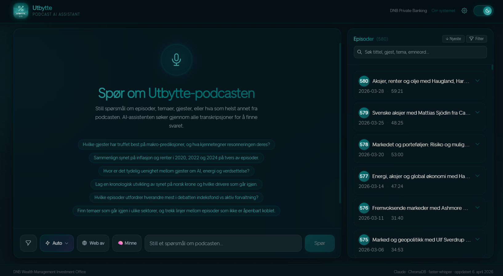

# Utbytte Agenten

> **Snapshot — April 2026.** This repository is a point-in-time export of the project as it stood in early April 2026. The pipeline was complete (580/580 episodes), the full-stack app was live, and the custom instructions + supervised feedback feature had just shipped. No further development is planned in this public repo.

AI-powered Q&A for the **[Utbytte](https://feeds.acast.com/public/shows/utbytte)** podcast by DNB.

The system downloads, transcribes, and semantically indexes all 580 podcast episodes, then answers natural-language questions in Norwegian with full source citations pointing to the exact episode, timestamp, and quote that supports each answer.



> Built with FastAPI, Next.js 14, ChromaDB, sentence-transformers, faster-whisper, and Claude Opus 4.6 (EU) via an OpenAI-compatible proxy.
>
> **580/580 episodes** fully transcribed with Whisper large-v3. ChromaDB index: 11,836 chunks. Pipeline complete.
>

---

## How It Works

### System Architecture

```
┌─────────────────────────────────────────────────────────────────────────────┐
│                           UTBYTTE AGENTEN                                   │
├─────────────────────────────────────────────────────────────────────────────┤
│                                                                             │
│  ┌─────────────┐         ┌──────────────────────────────────────────────┐   │
│  │  Next.js 14  │  HTTP   │           FastAPI Backend (8000)             │   │
│  │  Frontend    │────────▶│                                              │   │
│  │  (3002)      │◀────────│  ┌──────────┐  ┌───────────┐  ┌──────────┐  │   │
│  └─────────────┘         │  │ /api/qa   │  │/api/episodes│ │/api/health│ │   │
│        │                 │  └─────┬─────┘  └───────────┘  └──────────┘  │   │
│        │                 │        │                                       │   │
│  GitHub Pages            │        ▼                                       │   │
│  (gh-pages)              │  ┌──────────┐    ┌─────────────────────────┐  │   │
│                          │  │ QA Agent │───▶│  Claude Opus 4.6 (EU)   │  │   │
│                          │  └─────┬────┘    │  via Radical Gateway    │  │   │
│                          │        │         │  (OpenAI SDK)           │  │   │
│                          │        │         └─────────────────────────┘  │   │
│                          │        │                                       │   │
│                          │        ▼                                       │   │
│                          │  ┌──────────────────────────────────────────┐  │   │
│                          │  │           Multi-Query RAG                 │  │   │
│                          │  │                                          │  │   │
│                          │  │  Question ──▶ Expand to 4 queries        │  │   │
│                          │  │              (original + 3 LLM variants) │  │   │
│                          │  │                     │                     │  │   │
│                          │  │                     ▼                     │  │   │
│                          │  │  4 queries × 30 chunks each              │  │   │
│                          │  │         │                                 │  │   │
│                          │  │         ▼                                 │  │   │
│                          │  │  Merge by chunk ID (best similarity)     │  │   │
│                          │  │         │                                 │  │   │
│                          │  │         ▼                                 │  │   │
│                          │  │  Filter ≥40% similarity, cap at 80       │  │   │
│                          │  │         │                                 │  │   │
│                          │  │         ▼                                 │  │   │
│                          │  │  Build context ──▶ LLM ──▶ Answer        │  │   │
│                          │  └───────────┬──────────────────────────────┘  │   │
│                          │              │                                  │   │
│                          │              ▼                                  │   │
│                          │  ┌──────────────────┐  ┌────────────────────┐  │   │
│                          │  │    ChromaDB       │  │ sentence-transformers│ │   │
│                          │  │ (vector search)   │  │ MiniLM-L12-v2 384d │ │   │
│                          │  │ cosine similarity │  │ (local embeddings)  │ │   │
│                          │  └──────────────────┘  └────────────────────┘  │   │
│                          └───────────────────────────────────────────────┘   │
│                                                                             │
├─────────────────────────────────────────────────────────────────────────────┤
│                     INGESTION PIPELINE (offline)                            │
│                                                                             │
│  ┌─────────┐   ┌────────────┐   ┌──────────────┐   ┌─────────┐   ┌─────┐  │
│  │ Planner │──▶│ Downloader │──▶│ Transcriber  │──▶│ Chunker │──▶│ DB  │  │
│  │         │   │            │   │              │   │         │   │     │  │
│  │ RSS     │   │ yt-dlp     │   │ faster-      │   │ 300-word│   │Chroma│ │
│  │ feed    │   │ Acast CDN  │   │ whisper      │   │ windows │   │ DB  │  │
│  │ diff vs │   │ MP3 files  │   │ large-v3     │   │ overlap │   │upsert│ │
│  │manifest │   │            │   │ beam_size=5  │   │ embed   │   │     │  │
│  └─────────┘   └────────────┘   └──────────────┘   └─────────┘   └─────┘  │
│       │              │                │                  │            │     │
│       ▼              ▼                ▼                  ▼            ▼     │
│  manifest.json   audio/*.mp3    transcripts/       384d vectors   chromadb/ │
│                                 *.md + *.jsonl                              │
│                                                                             │
├─────────────────────────────────────────────────────────────────────────────┤
│                          DEPLOYMENT                                         │
│                                                                             │
│  Local machine                      Cloud                                   │
│  ┌────────────────────┐             ┌────────────────────────────┐          │
│  │ watch_pipeline.py  │             │ Railway (us-west2)         │          │
│  │ watchdog.py        │             │  └─ Dockerfile.backend     │          │
│  │ retranscribe.py    │             │  └─ CPU-only PyTorch       │          │
│  │ 3× whisper workers │             │  └─ startup.sh (bg reindex)│          │
│  │ venv312/           │             │  └─ /api/* endpoints       │          │
│  └────────────────────┘             └────────────────────────────┘          │
│                                     ┌────────────────────────────┐          │
│  deploy-pages.ps1 ────────────────▶ │ GHE GitHub Pages           │          │
│  (git worktree)                     │  └─ gh-pages branch        │          │
│                                     │  └─ static Next.js export  │          │
│  railway up ──────────────────────▶ └────────────────────────────┘          │
│                                                                             │
└─────────────────────────────────────────────────────────────────────────────┘
```

### Ingestion pipeline (offline, run once)

```
Planner  Downloader  Transcriber  Chunker  Database
```

1. **Planner** reads the RSS feed and checks which episodes haven't been processed yet
2. **Downloader** fetches the MP3 audio file for each new episode
3. **Transcriber** runs Whisper (`large-v3` model) to produce timestamped Norwegian text
4. **Chunker** splits transcripts into ~300-word overlapping windows and generates 384-dimensional sentence embeddings
5. **Database** upserts the chunks and vectors into ChromaDB

### Query pipeline (real-time, per question)

```
Question  Embed  Cosine search  Top-5 chunks  Prompt  LLM  Answer + citations
```

1. The question is expanded into 4 search queries (original + 3 LLM-generated alternatives)
2. Each query retrieves 30 chunks from ChromaDB; results are merged by chunk ID (best similarity wins)
3. Chunks are filtered by 40% similarity threshold, capped at 80, and injected as context
4. Claude Opus 4.6 generates a grounded answer with source references and episode citations

**Web mode** (optional): when enabled, runs 2–3 LLM-generated DuckDuckGo queries in parallel with ChromaDB retrieval. Results are deduplicated by domain (max 2 per domain), scored by trusted-source boost (Reuters, Bloomberg, Norges Bank, SSB), and injected as a labelled `WEB-KILDER` block. The frontend renders inline `[WEB N]` citations as superscripts (¹²³).

**Custom instructions + feedback** (per-user personalisation): users set tone, language, and focus presets (or free text) via the 🧠 Minne panel. These are injected at the top of every prompt. Thumbs up/down + optional correction per answer is stored in SQLite (`backend/storage/userdata.db`). The last 5 personal corrections are injected as few-shot examples. Every 10th feedback save triggers `aggregate_corrections()` — keyword-overlap clustering promotes patterns present in ≥2 distinct users to a global memory table, which is then injected for all users. User identity is an anonymous UUID persisted in `localStorage`; no authentication required.

---

## Agent Components

| Agent | File | What it does |
|-------|------|-------------|
| `PlannerAgent` | `agents/planner.py` | Parses RSS feed, diffs against manifest, yields new episodes |
| `DownloaderAgent` | `agents/downloader.py` | Downloads MP3 with progress tracking, retries on failure |
| `TranscriberAgent` | `agents/transcriber.py` | Runs faster-whisper, outputs `.jsonl` (segments) + `.md` (readable) |
| `ChunkerAgent` | `agents/chunker.py` | Splits on sentence boundaries, generates multilingual embeddings |
| `DatabaseAgent` | `agents/database.py` | ChromaDB upsert + cosine similarity query |
| `QAAgent` | `agents/qa.py` | Multi-query RAG: expand query → 4×30 chunk search → merge → build prompt (with injected user instructions, corrections, and global memory) → call LLM; optional web search via DuckDuckGo |

All agents extend `BaseAgent` (abstract class with `run()`, `log()`, and error hooks). The pipeline orchestrator processes up to 8 episodes in parallel using `asyncio`.

---

## Prerequisites

| Requirement | Version | Notes |
|-------------|---------|-------|
| Python | 3.12 | Avoid 3.14  limited torch/whisper support |
| Node.js | 20+ | For the Next.js frontend |
| ffmpeg | any | Required by faster-whisper for audio decoding |
| LLM | — | Any OpenAI-compatible API (Ollama, OpenAI, Anthropic, Azure OpenAI) |

> Embeddings run locally via `sentence-transformers`  no embedding API key needed.

---

## Quick Start

### 1. Clone and configure

```bash
git clone https://github.com/kevinha98/DNB-Utbytte-Podcast-RAG-Pipeline.git
cd DNB-Utbytte-Podcast-RAG-Pipeline
cp .env.example .env
```

Edit `.env` and set your LLM credentials:

```env
# Option A → Ollama (local, recommended)
LLM_API_KEY=ollama
LLM_URL=http://localhost:11434/v1
LLM_MODEL=qwen3:8b

# Option B → OpenAI
LLM_API_KEY=your-openai-api-key
LLM_URL=https://api.openai.com/v1
LLM_MODEL=gpt-4o
```

### 2. Backend setup

```bash
cd backend

# Create virtualenv (Python 3.12)
python -m venv venv312

# Activate
.\venv312\Scripts\activate        # Windows
source venv312/bin/activate        # Linux / macOS

# Install dependencies
pip install uv
uv pip install -r requirements.txt
```

### 3. Run the pipeline

Download, transcribe, and index all unprocessed episodes:

```bash
python main.py pipeline
# or process a batch:
python main.py pipeline -n 20
```

Approximate speed on CPU (2 workers, large-v3):
- Download: ~30s per episode (network), 8 concurrent
- Transcribe (Whisper large-v3, CPU): ~30–60 min per hour of audio, 2 workers
- Embed + index: ~5s per episode

### 4. Re-transcribe with large-v3 (batch mode)

> **All 580 episodes are already large-v3 quality as of 2026-04-05.** This step is only needed if new episodes are released and you want to upgrade them beyond the default small baseline.

```powershell
# Preview next 50 episodes (no changes)
python retranscribe.py --batch 50 --dry-run

# Reset 50 episodes + write .env for large-v3 with 2 workers
python retranscribe.py --batch 50

# Then start the pipeline with watchdog:
$env:PYTHONUTF8='1'
Start-Process -NoNewWindow -FilePath '.\venv312\Scripts\python.exe' `
  -ArgumentList 'watchdog.py' `
  -RedirectStandardOutput 'watchdog_out.log' `
  -RedirectStandardError 'watchdog_err.log'
```

### 5. Start the API

```bash
python main.py serve
# API ready at http://localhost:8000
# Interactive docs at http://localhost:8000/docs
```

### 6. Start the frontend

```bash
cd ../frontend
npm install
npm run dev
# Open http://localhost:3002
```

### Docker (alternative)

```bash
cp .env.example .env   # configure first
docker-compose up --build
```

Starts backend on port 8000 and frontend on port 3002.

---

## Pipeline Commands (Windows PowerShell)

Run all commands from `backend/`:

```powershell
# START pipeline with watchdog (auto-restarts on crash / stall / OOM)
$env:PYTHONUTF8='1'
Start-Process -NoNewWindow -FilePath '.\venv312\Scripts\python.exe' `
  -ArgumentList 'watchdog.py' `
  -RedirectStandardOutput 'watchdog_out.log' `
  -RedirectStandardError 'watchdog_err.log'

# STOP pipeline
Get-Process python -ErrorAction SilentlyContinue | Stop-Process -Force

# STATUS
$env:PYTHONUTF8='1'; .\venv312\Scripts\python.exe watch_pipeline.py --target 580

# BATCH PREP — reset N episodes for large-v3 re-transcription (newest-first)
.\venv312\Scripts\python.exe retranscribe.py --batch 50 --dry-run  # preview
.\venv312\Scripts\python.exe retranscribe.py --batch 50            # reset + write .env
```

---

## API Reference

Base URL: `http://localhost:8000`

| Method | Endpoint | Description |
|--------|----------|-------------|
| `GET` | `/api/health` | Health check + pipeline status |
| `POST` | `/api/pipeline/start` | Start or resume ingestion |
| `GET` | `/api/pipeline/status` | Progress, current episode, ETA |
| `GET` | `/api/episodes` | List all episodes (filterable) |
| `GET` | `/api/episodes/{num}` | Episode detail + full transcript |
| `POST` | `/api/qa` | Ask a question — returns answer + citations |
| `GET` | `/api/topics` | Keywords/topics per episode |
| `GET` | `/api/user/instructions` | Get saved user instructions (requires `X-User-ID` header) |
| `PUT` | `/api/user/instructions` | Save user instructions |
| `POST` | `/api/feedback` | Submit thumbs up/down + optional correction |
| `GET` | `/api/user/feedback` | List personal feedback history |
| `DELETE` | `/api/user/feedback/{id}` | Delete a feedback entry |
| `GET` | `/api/global/memory` | Read aggregated cross-user learning patterns |

Interactive Swagger UI: `http://localhost:8000/docs`

---

## Usage Examples

### Ask a question (Norwegian)

```bash
curl -X POST http://localhost:8000/api/qa \
  -H "Content-Type: application/json" \
  -d '{"question": "Hva sier podcasten om utbytte fra oljeselskaper?"}'
```

Response:

```json
{
  "answer": "Podcasten diskuterer utbytte fra oljeselskaper i flere episoder. I episode 2 forklares det at norske oljeselskaper historisk har gitt høye utbytter på grunn av stabile kontantstrømmer og statsstøtte. I episode 14 stilles spørsmål om bærekraften av dette utbyttenivået i en energitransisjon...",
  "sources": [
    {
      "episode_number": 2,
      "title": "Veien videre for oljemarkedet og energisektoren på børsen",
      "timestamp": "00:14:22",
      "relevant_text": "...norske oljeselskaper har en lang tradisjon for høye utbytter...",
      "similarity": 0.91
    },
    {
      "episode_number": 14,
      "title": "Energitransisjon og aksjer",
      "timestamp": "00:31:07",
      "relevant_text": "...spørsmålet er om disse utbyttene er bærekraftige...",
      "similarity": 0.84
    }
  ]
}
```

### Filter by episode range or date

```bash
curl -X POST http://localhost:8000/api/qa \
  -H "Content-Type: application/json" \
  -d '{
    "question": "Hva sa de om renter i 2023?",
    "filters": {
      "date_from": "2023-01-01",
      "date_to": "2023-12-31"
    }
  }'
```

### List episodes with search

```bash
curl "http://localhost:8000/api/episodes?q=handelskrig&limit=5"
```

---

## Transcript Format

Each episode produces two files in `backend/storage/transcripts/`:

**`001_episode-title.md`**  human-readable with timestamps:
```markdown
---
title: "Episode 1  Svakere globalt, bra fart lokalt"
episode: 1
date: 2019-01-15
duration: "34:22"
model: large-v3
---

[00:00:00] Velkommen til Utbytte, DNB sin podcast om investering og spare...

[00:01:12] Vi starter med å se på den globale situasjonen. Det er tydelig at...

[00:08:45] La oss gå til Oslo Børs. Norsk økonomi har vist god motstandskraft...
```

**`001_episode-title.jsonl`**  one JSON object per Whisper segment:
```jsonl
{"episode_id": 1, "segment": 0, "start": 0.0,  "end": 5.2,  "text": "Velkommen til Utbytte..."}
{"episode_id": 1, "segment": 1, "start": 5.2,  "end": 12.8, "text": "DNB sin podcast om..."}
```

**580/580 transcripts** — all large-v3 quality (completed 2026-04-05). All 580 MP3s downloaded. The vector database (11,836 chunks) is derived from transcripts and is **not committed** (rebuild with `python reindex.py`).

---

## Environment Variables

| Variable | Default | Description |
|----------|---------|-------------|
| `LLM_API_KEY` |  | API key for LLM (`ollama` for local Ollama) |
| `LLM_URL` | `http://localhost:11434/v1` | OpenAI-compatible chat completions URL |
| `LLM_MODEL` | `Claude Opus 4.6 (EU)` | Model name |
| `EMBEDDING_MODEL` | `paraphrase-multilingual-MiniLM-L12-v2` | Sentence-transformers model (local) |
| `WHISPER_MODEL` | `large-v3` | Whisper model size (`tiny` / `small` / `medium` / `large-v3`) |
| `WHISPER_DEVICE` | `cpu` | `cpu` or `cuda` |
| `WHISPER_COMPUTE_TYPE` | `int8` | `int8` (fast, low RAM) / `float16` (GPU) / `float32` |
| `RSS_FEED_URL` | `https://feeds.acast.com/...` | Podcast RSS feed |
| `MAX_CONCURRENT_EPISODES` | `8` | Parallel episode processing |
| `CHUNK_SIZE_TOKENS` | `750` | Tokens per chunk |
| `CHUNK_OVERLAP_TOKENS` | `100` | Overlap between chunks |
| `API_HOST` | `0.0.0.0` | API server bind address |
| `API_PORT` | `8000` | API server port |
| `FRONTEND_URL` | `http://localhost:3002` | Frontend origin (CORS) |

See `.env.example` for all options with comments.

---

## LLM Options

All options use the OpenAI-compatible chat completions API. Switch provider by updating three `.env` variables — no code changes needed.

| Provider | Speed | Cost | Best for |
|----------|-------|------|----------|
| **Claude Opus 4.6** via any OpenAI-compatible proxy | Medium | API key | Production quality |
| **Claude Sonnet 4.6** via any OpenAI-compatible proxy | Fast | API key | Shorter queries (auto-selected) |
| **Ollama qwen3:8b** | Medium | Free | Fully local / offline |
| **Groq llama-3.1** | Very fast | Free tier | Low-latency queries |

---

## Performance

| Operation | Hardware | Speed |
|-----------|----------|-------|
| Whisper transcription (large-v3) | CPU (2 workers) | ~30–60 min / hour of audio |
| Embedding generation | CPU | ~5s / episode |
| ChromaDB query (4×30 chunks) | CPU | <200ms |
| Claude Opus 4.6 answer | Radical Gateway | ~8–15s |
| Full web mode query (search + LLM) | API | ~15–25s |
| Ollama qwen3:8b answer | CPU (16GB RAM) | ~5–15s |

With 2 parallel workers and Whisper large-v3 on CPU, expect ~3–4 days for a full 580-episode run. Use `retranscribe.py --batch N` to process in chunks. The pipeline resumes from where it left off — run `python main.py pipeline` to continue.

---

## Cost Estimate

| Component | Cost |
|-----------|------|
| Embeddings (sentence-transformers) | Free  runs locally |
| ChromaDB | Free  embedded, no server needed |
| Whisper transcription | Free  runs locally |
| Gemini 2.5 Flash QA queries | Free (20 requests/day on free tier) |
| Ollama (all local) | Free |

---

## Transcript Status

```
Total episodes:   580
MP3s downloaded:  580  (backend/storage/audio/ — gitignored, NEVER DELETE)
Transcribed:      580  (all large-v3, completed 2026-04-05)
ChromaDB chunks:  11,836 across 580 episodes (not committed — rebuild with python reindex.py)
```

---

## Deployment

### GitHub Pages (frontend)

Deploy manually using the provided script (uses `git worktree` — safe for gitignored storage files):

```powershell
PowerShell -ExecutionPolicy Bypass -File deploy-pages.ps1
# Never use -SkipBuild after code changes
```

The script builds Next.js, exports to `out/`, pushes to the `gh-pages` branch via a temp worktree. It never touches `backend/storage/`.

### Railway (backend)

Backend runs on Railway. Deploy via the Railway dashboard (Redeploy button) or CLI:

```powershell
$env:RAILWAY_TOKEN='your-token'
npx.cmd @railway/cli up --service utbytte-backend --detach
```

> Dockerfile uses CPU-only PyTorch to stay under Railway's 4 GB image limit. `startup.sh` runs reindex in the background so the healthcheck passes immediately. A Railway Volume is mounted at `/app/storage/chromadb` so the vector index persists across deploys — reindex only runs on the very first deploy or if manually cleared.

### Docker Compose (full stack)

```bash
cp .env.example .env   # configure first
docker-compose up --build
```

Starts backend on port 8000 and frontend on port 3002.

---

## Project Structure

```
utbytte-agenten/
 backend/
    agents/
       base.py          # BaseAgent ABC  run(), log(), error hooks
       planner.py       # RSS parser  diffs feed against manifest
       downloader.py    # MP3 downloader with retry + progress
       transcriber.py   # faster-whisper  .jsonl + .md
       chunker.py       # Sentence splitting + multilingual embeddings
       database.py      # ChromaDB upsert + cosine query
       qa.py            # RAG: embed  retrieve  prompt  LLM
    api/
       main.py          # FastAPI app, CORS, lifespan
       schemas.py       # Pydantic request/response models
       routes/
           episodes.py  # Episode list + detail endpoints
           pipeline.py  # Pipeline start/status
           qa.py        # Q&A streaming endpoint
           topics.py    # Topic/keyword search
           user.py      # User instructions, feedback, global memory
    models/
       episode.py       # Episode dataclass (id, title, date, url, ...)
       chunk.py         # Chunk dataclass (text, embedding, metadata)
    pipeline/
       orchestrator.py  # Async pipeline runner (asyncio, 8 workers)
    storage/
       transcripts/     # Committed: .md + .jsonl per episode (188 eps)
       audio/           # Gitignored: downloaded MP3 files
       chromadb/        # Gitignored: vector store (rebuild locally)
       userdata.db      # Gitignored: SQLite — user instructions, feedback, global memory
    db_userdata.py       # SQLite helpers (4 tables, TTL cache, aggregation)
    config.py            # pydantic-settings  all env vars typed
    main.py              # CLI: pipeline / serve / ingest-only
    requirements.txt
 frontend/
    src/
        app/             # Next.js App Router pages
        components/      # React UI components (Tailwind, WMIO-styled)
            ChatInterface.tsx  # Main chat UI with model picker, web/memory toggles, feedback
            MemoryPanel.tsx    # 3-tab user instructions + feedback history + system learning
            AnswerPanel.tsx    # Episode source citations
        hooks/
            useUserId.ts # Anonymous UUID persisted in localStorage
            useTheme.ts  # Dark/light mode
        lib/api.ts       # Typed API client (fetch wrappers + user/feedback endpoints)
        types/           # TypeScript interfaces for Episode, QAResponse
 docs/
    architecture.md      # System design, RAG pipeline, agent details
    deployment.md        # Docker, Vercel, Cloud Run, Supabase
    development.md       # Local setup, adding agents, troubleshooting
 docker-compose.yml
 Dockerfile.backend
 Dockerfile.frontend
 .env.example
 README.md
```

---

## Development

See **[docs/development.md](docs/development.md)** for:
- Full local setup walkthrough
- Adding a new agent (BaseAgent subclass pattern)
- Running tests
- Common issues and fixes

---

## Roadmap

- [ ] `--ingest-only` flag  reindex existing transcripts without re-downloading audio
- [ ] Streaming LLM responses via Server-Sent Events
- [ ] Episode-level chat history (follow-up questions with context)
- [ ] Supabase pgvector backend (cloud-native vector storage)
- [ ] GPU Whisper support (`cuda` device for faster transcription)
- [x] GitHub Pages deploy via GitHub Actions
- [x] Dark / light mode toggle
- [ ] Automated nightly pipeline via GitHub Actions

---

## License

Internal  DNB WMIO. Not for public distribution.
